## **开始前的热血**

买配件、接线，到设计、开发，以及最后的建模、3D打印，我都希望是自己动手，这比在淘宝上直接买一个成品要好得多。

这是我的开发日记，也希望它能够是一份美好的回忆。

## **2024/4/2**

- TFT显示屏到了，终于可以开始接线使用了~

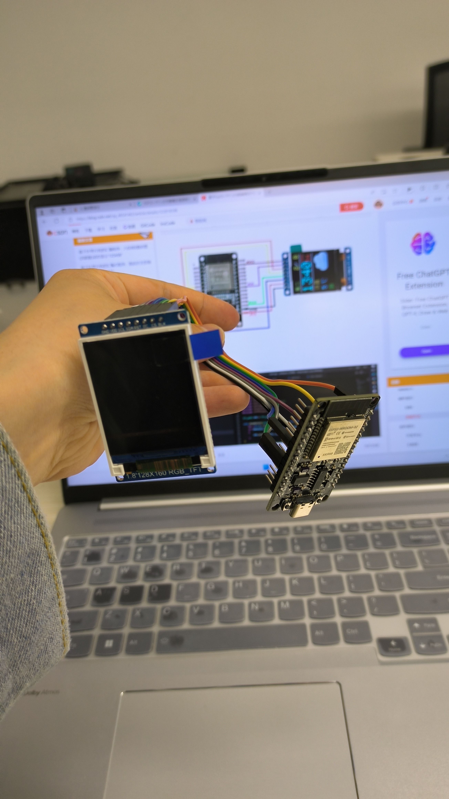

线接得不对所以屏幕无法显示出图片")

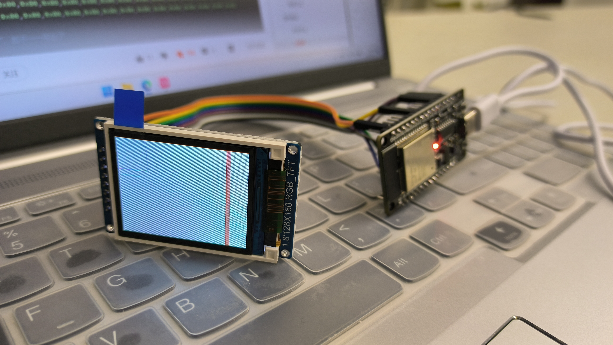

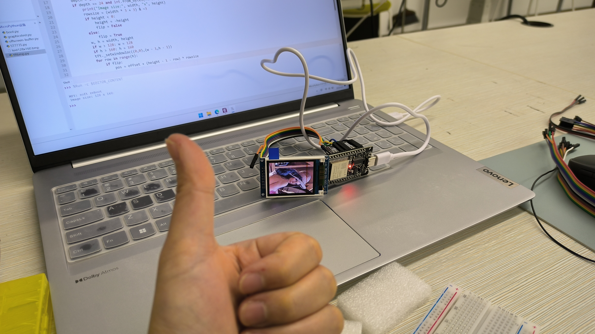

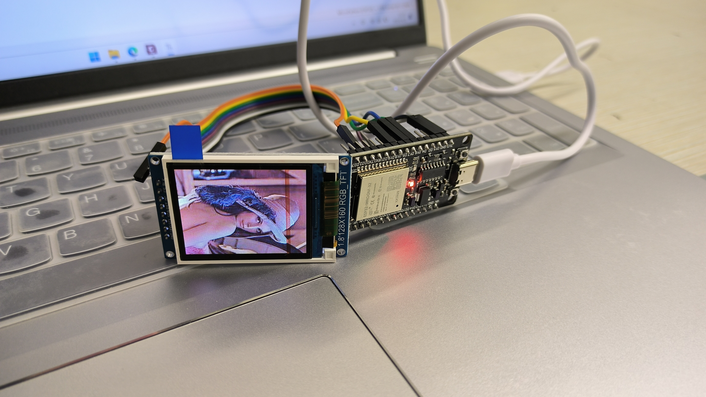

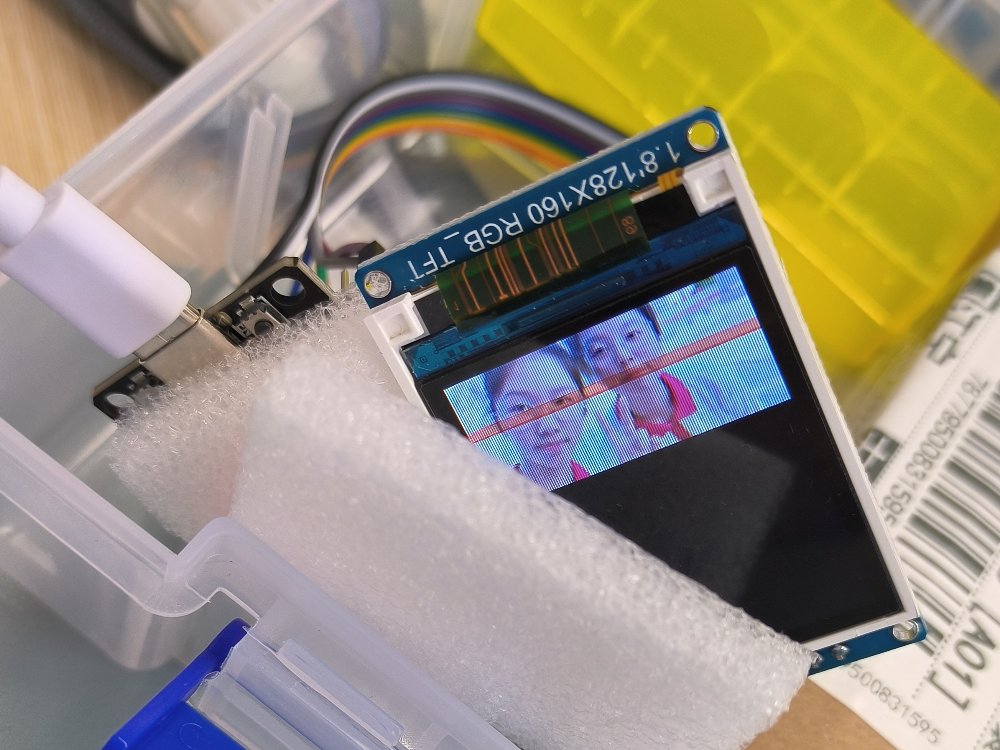

- **进度记录**
  - 接线完毕
  - MicroPython-ST7735烧录完成

- **待解决**
  - solid works建模，为开发板做个外壳
  - 如何实现ESP32上电自动执行程序

## **2024/4/3**

由于**个人能力所限**，开始**退而求其次**，准备从网上的开源项目入手，为的是省去3D建模这些学习时间线较长、且和专业方向关系小的步骤。

因为用MicroPython开发天气时钟的资料实在是少之又少，我不得已把开发平台进行了迁移，开发语言也变成了C语言。

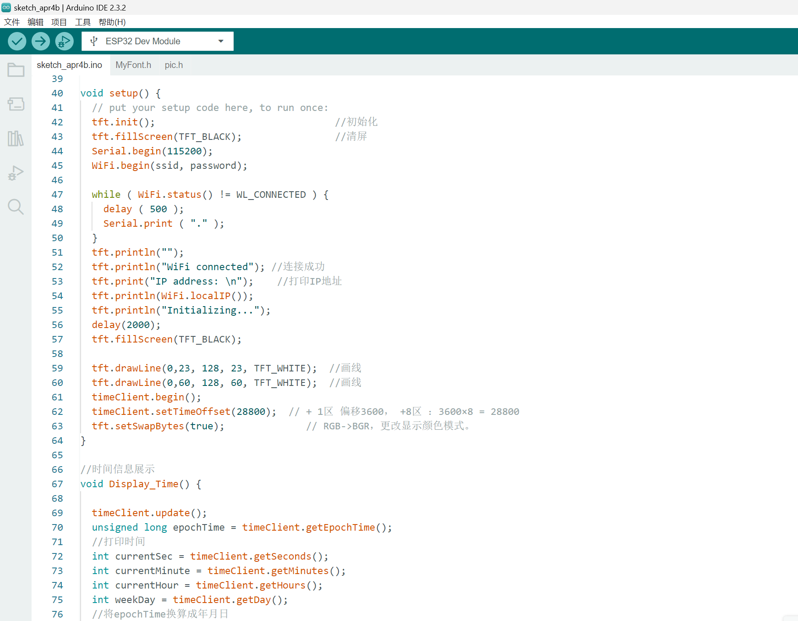

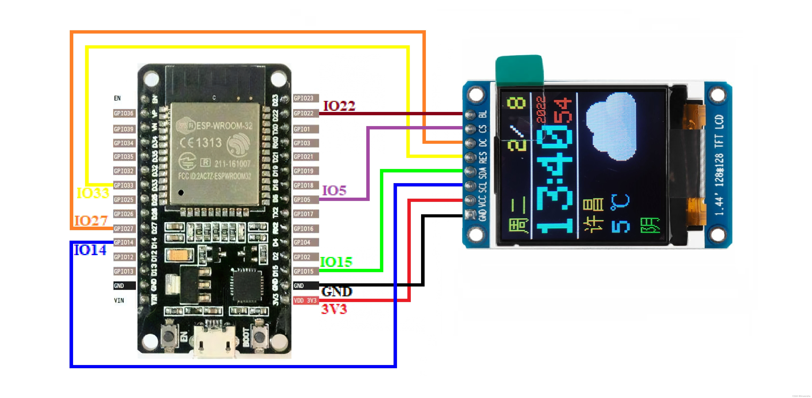

- 花屏了···改了无数种接线，最终无果
  - 这一步花了我接近一天的时间，我一直以为是引脚接得不对，后来才意识到原因不在此

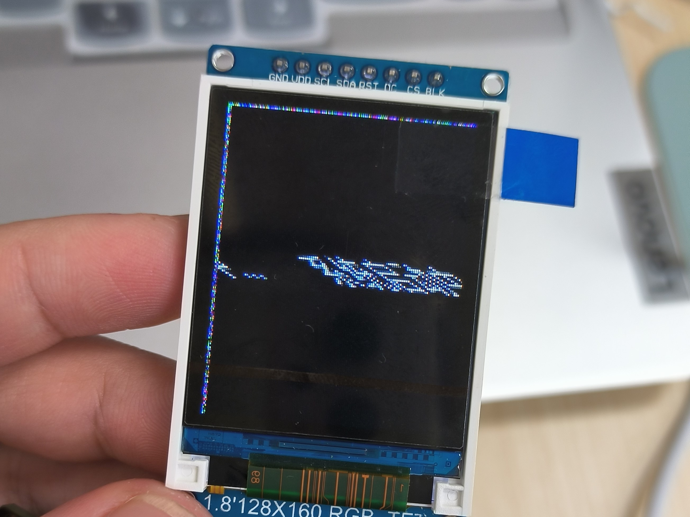

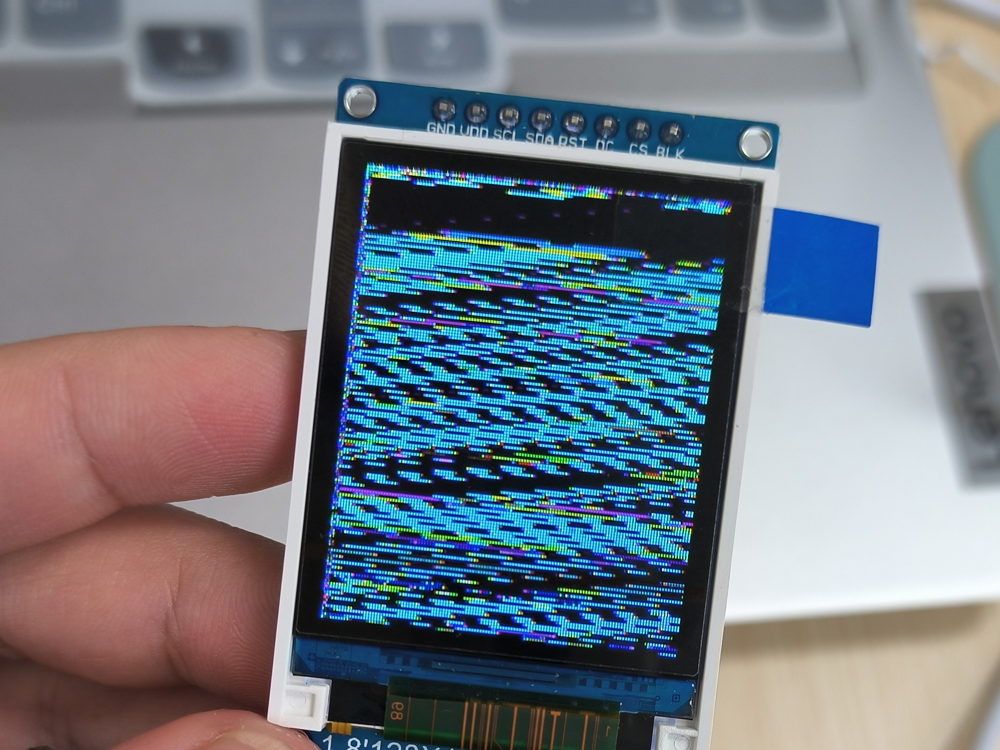

- 剧烈的落败感
  - 把接线全部撤了，放回盒子里

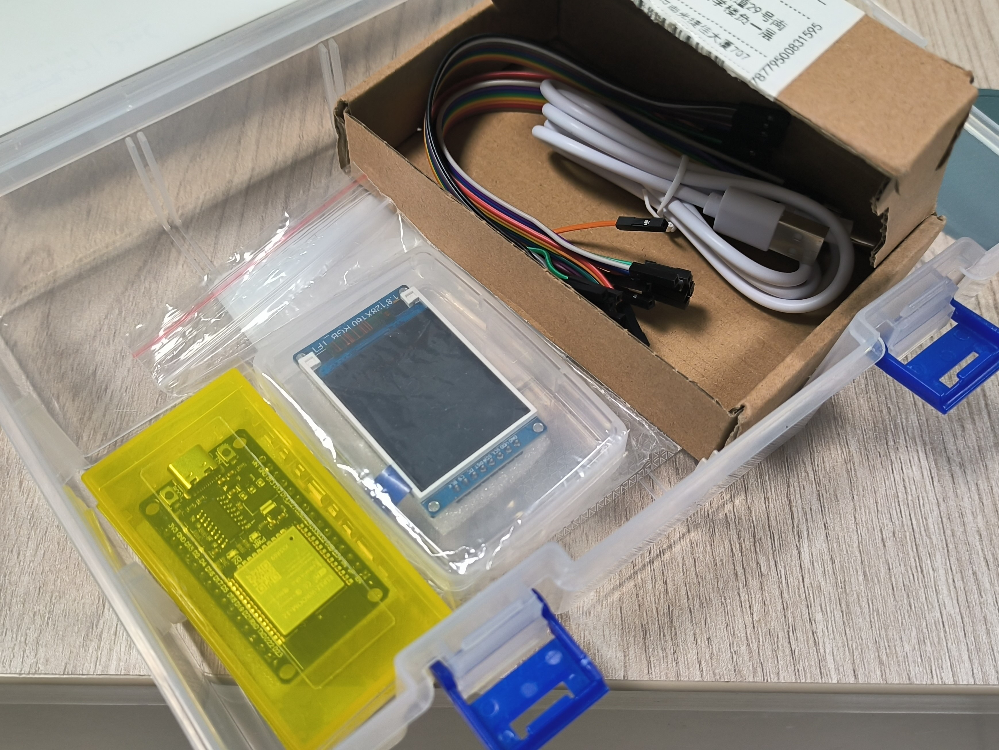

(还是不死心，又在网上找了各种开源资料到凌晨)

## **2024/4/4**

**继续尝试一些具有可行性的方法**

- 企图直接烧录bin文件，因为型号不匹配等原因而无果

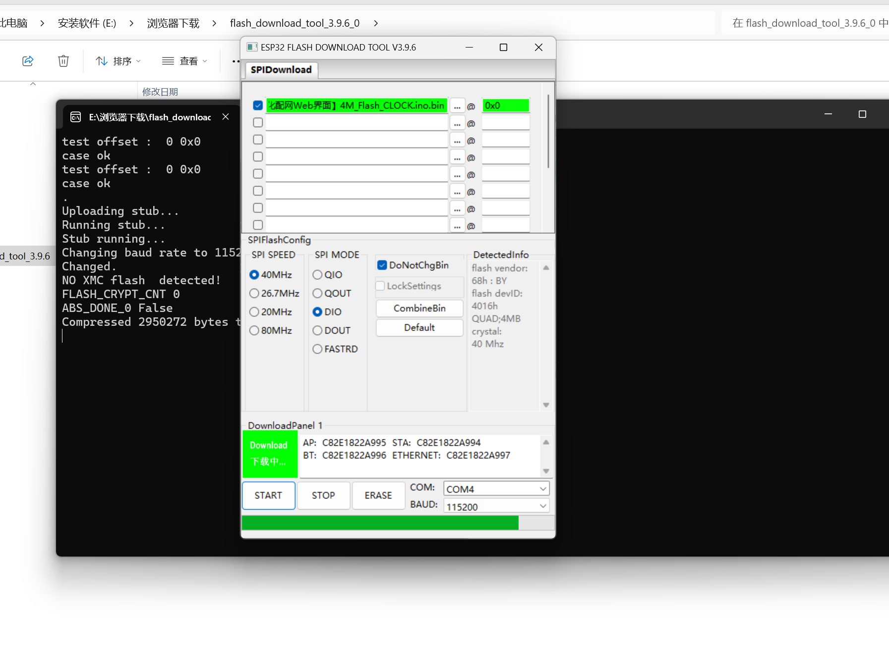

- 选择了CSDN上开源的一份资料，把开发平台由PlatformIO迁到Arduino
  - PlatformIO因为在VSCode里配置C语言环境不顺利最终将我劝退
  - 在原有代码基础上做了一些修改，图片显示始终有问题，最后只得去掉这一部分，留了一块突兀的区域
  - **最终实现的功能**
    - 显示日期、时间
    - 联网查询当地天气情况(通过调用API)

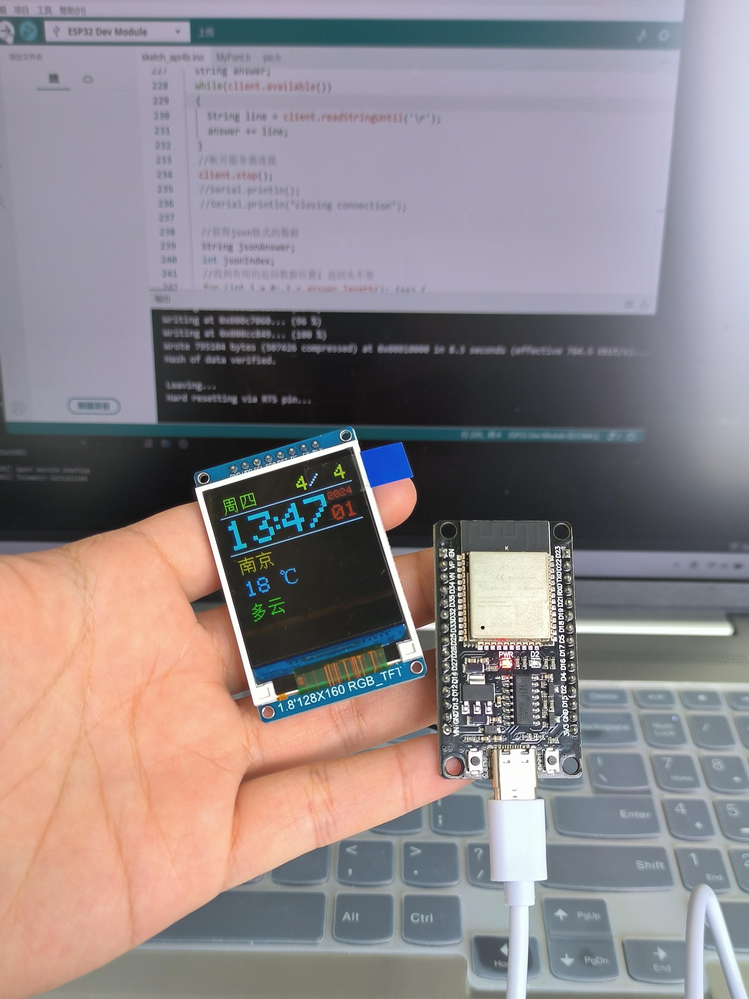

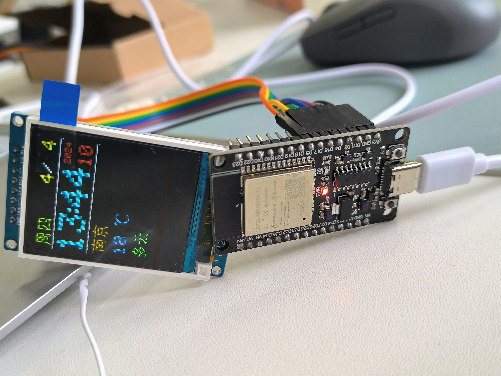

## **总结与反思**

其实还有很多值得改进的地方，但是我的时间和精力都不允许我再深究下去。

开发的这几天里心里总是惦记着它，我属于那种心里住着事儿就无法专心学习的人。幸亏要放假了，我也就把许多任务往后挪了挪，这几天全身心地专注于这件事，但是情绪也一直为之牵动着。

开发完后就是一种很落寞，甚至觉得有些挫败和不值得的感觉，但是不管是哪种感受，都算是一种收获。

总之还是挺不错的！收获是半项新技能；遗憾就是它可能没法作为一份生日礼物送给我的好朋友了，以及最初的豪言壮志也几乎无法实现。