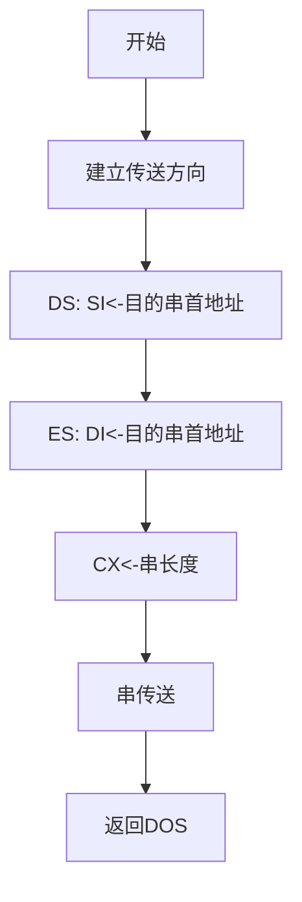



## **不含I/O的程序设计**

### 计算 Z=X*X - Y/5

```assembly
DATA SEGMENT
    
    X DB 10
    Y DB -20
    Z DW ?
    
DATA ENDS

CODE SEGMENT
    
    ASSUME DS:DATA, CS:CODE
      
  MAIN PROC FAR
    ;前3句是标准序，后3句是数据段的赋值
    PUSH DS
    SUB AX, AX
    PUSH AX
    MOV AX, DATA     ;初始化DS
    MOV DS, AX
                  
    MOV AL, X
    IMUL AL
    MOV BX, AX      ;BX <= X*X
    
    MOV AL, Y
    CBW     ;将被除数扩展为字数据
    MOV CL, 5
    IDIV CL
    CBW     ;AX <= Y/5
    
    SUB BX, AX
    MOV Z, BX       ;Z <= BX-AX
    
    RET     ;过程结束，返回DOS
  MAIN ENDP
  CODE ENDS

    END MAIN
```

### 将某段中的字符串"Hello"传送到另一段中(内存数据块的传送)



```assembly
aa SEGMENT      ;数据段1
    xx DB 'Hello!'      ;定义源串  
aa ENDS

bb SEGMENT      ;数据段2
    yy DB 6 DUP(?)      ;定义目的缓冲区
bb ENDS

cc SEGMENT      ;代码段
    ASSUME CS:cc, DS:aa, ES:bb      ;指示指令中标号、变量所在段
    
start:CLD       ;设置传送方向
    MOV AX, aa      ;DS: SI←源串首地址
    MOV DS, AX
    LEA SI, xx
    MOV AX, SEG yy      ;ES: DI←目串的首地址
    MOV ES, AX
    MOV DI, OFFSET yy
    MOV CX, 6       ;CX←串的长度
    REP MOVSB       ;串传送
    MOV AH, 4CH     ;调用4CH系统功能，返回DOS
    INT 21H

cc ENDS
    END start       ;指示程序结束和程序入口
```

**可以借用这个程序对比各种方式，如MOV OFFSET和LEA，段基址、偏移量的赋值等等**

### 分段函数


$$Z = \begin{cases}-1 & \text{if }X<Y, \\
0 & \text{if }X=Y, \\1 & \text{if }X>Y\end{cases}$$


**思路：将X和Y的值赋给两个寄存器，再比较，三分支**

```assembly
DAT SEGMENT
    X DB 242
    Y DB 67
    Z DB ?
DAT ENDS

COD SEGMENT
    ASSUME DS:DAT, CS: COD
    
  MAIN PROC FAR
    PUSH DS     ;标准序
    SUB AX, AX
    PUSH AX
    MOV AX, DAT
    MOV DS, AX      ;初始化DS
    
    MOV AL, X
    MOV BL, Y
    CMP AL, BL
    JE C1       ;AL=BL 则跳转至C1，否则继续执行
    JA C2       ;AL>BL 则跳转至C2，否则继续执行
    MOV AL, -1      ;AL<BL 则无需跳转
    
  EXT:MOV Z, AL
    RET     ;返回DOS
    
  C1:MOV AL, 0
    JMP EXT
    
  C2:MOV AL, 1
    JMP EXT
    
  MAIN ENDP
  COD ENDS
    END MAIN
```

### 将AL寄存器低4位 2# 以 16# 形式显示


**注意：16#转换为ASCII码值时需要判断数的范围是0-9还是A-F之间**

```assembly
    AND AL, 0FH     ;取AL的低4位
    ADD AL, 30H     ;16#数→ASCII码值
    CMP AL, 3AH
    JB PIT      ;0-9，加上30H即为ASCII码
    ADD AL, 07H     ;A-F，还需加上7为其ASCII码
PIT:MOV DL, AL      ;DOS系统功能调用的2号子程序
    MOV AH, 02H     ;显示单个字符
    INT 21H
```

### 统计字节数据块：-1，-3，5，6，9，···中负元素的个数

**循环结构：先执行后判断**

```assembly
    .DATA	
BUF DB -1,-3,5-6,9,···		;定义若干字节带符号数
CUNT EQU $-BUF		;计算数据块长度
RESULT DW ?		;定义存放结果单元

    .CODE
    .STARTUP
    MOV BX, OFFSET BUF		;建立数据指针
    MOV CX, CUNT		;设置循环次数
    MOV DX, 0		;置结果初值
LP1:MOV AL, [BX]	;取数据
    AND AL, AL		;不改变AL但是会置标志位，用SF判断
    JNS PLUS		;是正数，转去PLUS
    INC DX		;是负数，负数个数+1
PLUS:INC BX		;调整数据指针
    LOOP LP1		;CX-1≠0，继续循环
    MOV RESULT, DX		;存入负数个数
    ···
```

### AX寄存器中有一个16位的二进制数，编程统计其中1的个数，结果存放在CX寄存器中

**循环结构：先判断再执行，当AX内容为全0时(算术左移，移出一位添一个0，但变为全0所需循环的次数未知)不必再继续统计**

```assembly
    MOV CX, 0		;置结果计数器初值
LP: AND AX, AX		;判断AX=0否
    JZ EXIT1		;是，退出循环
    SAL AX, 1		;否，AX的最高位移至CF中
    JNC ZERO		;CF=0，转ZERO继续循环
    INC CX		;CF=1，结果计数器加1
ZERO:JMP LP
EXIT1:···
```

### 设x、y、z已定义为字节变量。若x和y各存放一个32位(4字节)的无符号数，存放顺序是低位字节存入低地址，写出将x和y相加、结果存入z的程序段

```assembly
MOV AX, WORD PTR X
ADD AX, WORD PTR Y
MOV WORD PTR Z, AX
MOV AX, WORD PTR X+2
ADC AX, WORD PTR Y+2
MOV WORD PTR Z+2, AX
```

### 将内存中某一区域的数据块传送到另一区域中。考虑它们的地址可能重叠：先判断源首址加数据块长度是否小于目标首址，若小于，表明源数据块与目标数据块的地址没有重叠，按增量方式传送；反之，则调整地址指针按减量方式传送。定义相应数据区并完成程序设计

```assembly
DATA SEGMENT
    STRG DB 1000 DUP(?)
    STG1 EQU STRG+7
    STG2 EQU STRG+27
    STRSE EQU 50
DATA ENDS

STACK SEGMENT PARA STACK 'STACK'
    DB 100 DUP(?)
STACK ENDS

CODE SEGMENT
    
    ASSUME CS:CODE, DS:DATA, ES:DATA
MAIN:MOV AX, DATA
    MOV DS, AX
    MOV ES, AX
    MOV CX, STRSE
    MOV SI, OFFSET STG1
    MOV DI, OFFSET STG2
    CLD
    PUSH SI
    ADD SI, STRSE-1
    CMP SI, DI
    POP SI
    JL OK
    STD
    ADD SI, STRSE-1
    ADD DI, STRSE-1
OK: REP MOVSB
    MOV AX, 4C00H
    INT 21H
    
CODE ENDS
    END MAIN
```

### 两个以压缩BCD格式表示的16位十进制数(8字节)的加法运算，相加的两数X和Y以及和SUM可定义为字节变量，并假定高位存入低地址

```assembly
    LEA BX, X
    LEA SI, Y
    LEA DI, SUM
    ADD BX, 7
    ADD SI, 7
    ADD DI, 8       ;和可能要9个字节
    MOV CX, 8
    CLC
LOP:MOV AL, [BX]
    ADC AL, [SI]
    DAA
    MOV [DI], AL
    DEC BX
    DEC SI
    DEC DI
    DEC CX
    JNZ LOP
    MOV AL, 0
    ADC AL, 0
    MOV [DI], AL
```

### 从FIRST开始的100个单元中存放着一个结束符为'$'的字符串，统计该字符串中字母'A'的个数

```assembly
    MOV SI, OFFSET FIRST
    MOV CX, 0       ;CX中存放A的个数
LOOP:MOV AL, [SI]
    CMP AL, '$'
    JZ NEXT
    CMP AL, 'A'
    JNE LP
    INC CX
LP: INC SI
    JMP LOOP
NEXT:···
```

### 统计 DATA_W 字数组中正数、负数和0的个数，并分别保存在变量COUT1、COUT2、COUT3中

```assembly
DATA SEGMENT
    DATA_W DW ···        ;若干个数
    COUT EQU ($-DATA_W)/2
    COUT1 DB 0
    COUT2 DB 0
    COUT3 DB 0
DATA ENDS

STACK SEGMENT PARA STACK 'STACK'
    DB 100 DUP(0)
STACK ENDS

CODE SEGMENT
    
    ASSUME CS:CODE, DS:DATA
  START PROC FAR
    PUSH DS
    MOV AX, 0
    PUSH AX
    MOV AX, DATA
    MOV DS, AX
    MOV DX, 0       ;正数、负数、0暂时分别存在BL、BH、DL中
    MOV BX, 0
    LEA SI, DATA_W
    MOV CX, COUT
  NEXT:MOV AX, [SI]
    CMP AX, 0
    JG LP1
    JL LP2
    INC DDL
    JMP OK
  LP1:INC BL
    JMP OK
  LP2:INC BH
  OK:ADD SI, 2
    LOOP NEXT
    MOV COUT1, BL
    MOV COUT2, BH
    MOV COUT3, DL
    
    RET
  START ENDP
  CODE ENDS
    END START
```

### 找出无符号字节数组ARRAY中的最大与最小偶数，最大偶数送MAX单元，最小偶数送MIN单元

```assembly
DATA SEGMENT
    ARRAY DB ···     ;若干个数
    COUT EQU $-ARRAY
    MAX DB ?
    MAX DB ?
DATA ENDS

STACK SEGMENT PARA STACK 'STACK'
    DB 100 DUP(0)
STACK ENDS

CODE SEGMENT
    
    ASSUME CS:CODE, DS:DATA
  START PROC FAR
    PUSH DS
    MOV AX, 0
    PUSH AX
    MOV AX, DATA
    MOV DS, AX
    LEA BX, ARRAY
    MOV CX, COUT
  GOT:MOV AL, [BX]
    TEST AL, 01H
    JZ NEXT
    INC BX
    JMP GOT
  NEXT:MOV DH, AL
    MOV DL, AL      ;DH暂存最大偶数，DL暂存最小偶数，初始置首个偶数
    LEA BX, ARRAY
  LOP:MOV AL, [BX]
    TEST AL, 01H
    JNZ NEXT2
    CMP AL, DL
    JA NEXT1
    MOV DL, AL
    JMP NEXT2
  NEXT1:CMP AL, DH
    JB NEXT2
    MOV DH, AL
  NEXT2:INC BX
    LOOP LOP
    MOV MAX, DH
    MOV MIN, DL
    
    RET
  START ENDP
  CODE ENDS
    END START
```

