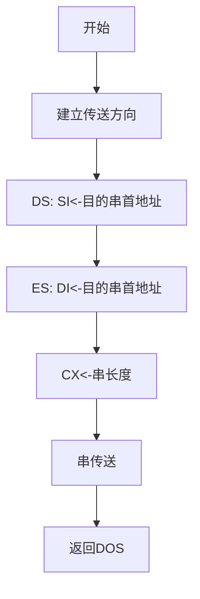

## **不含I/O的程序设计**

### 计算 Z=X*X - Y/5

```assembly
DATA SEGMENT
    
    X DB 10
    Y DB -20
    Z DW ?
    
DATA ENDS

CODE SEGMENT
    
    ASSUME DS:DATA, CS:CODE
      
  MAIN PROC FAR
    ;前3句是标准序，后3句是数据段的赋值
    PUSH DS
    SUB AX, AX
    PUSH AX
    MOV AX, DATA     ;初始化DS
    MOV DS, AX
                  
    MOV AL, X
    IMUL AL
    MOV BX, AX      ;BX <= X*X
    
    MOV AL, Y
    CBW     ;将被除数扩展为字数据
    MOV CL, 5
    IDIV CL
    CBW     ;AX <= Y/5
    
    SUB BX, AX
    MOV Z, BX       ;Z <= BX-AX
    
    RET     ;过程结束，返回DOS
  MAIN ENDP
  CODE ENDS

    END MAIN
```

### 将某段中的字符串"Hello"传送到另一段中(内存数据块的传送)



```assembly
aa SEGMENT      ;数据段1
    xx DB 'Hello!'      ;定义源串  
aa ENDS

bb SEGMENT      ;数据段2
    yy DB 6 DUP(?)      ;定义目的缓冲区
bb ENDS

cc SEGMENT      ;代码段
    ASSUME CS:cc, DS:aa, ES:bb      ;指示指令中标号、变量所在段
    
start:CLD       ;设置传送方向
    MOV AX, aa      ;DS: SI←源串首地址
    MOV DS, AX
    LEA SI, xx
    MOV AX, SEG yy      ;ES: DI←目串的首地址
    MOV ES, AX
    MOV DI, OFFSET yy
    MOV CX, 6       ;CX←串的长度
    REP MOVSB       ;串传送
    MOV AH, 4CH     ;调用4CH系统功能，返回DOS
    INT 21H

cc ENDS
    END start       ;指示程序结束和程序入口
```

