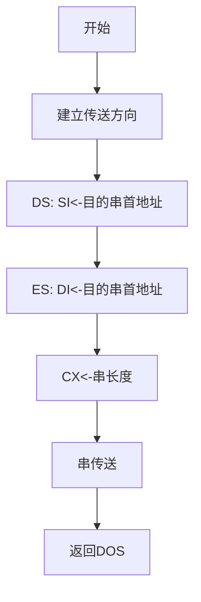



## **不含I/O的程序设计**

### 计算 Z = X*X - Y/5

```assembly
DATA SEGMENT
    
    X DB 10
    Y DB -20
    Z DW ?
    
DATA ENDS

CODE SEGMENT
    
    ASSUME DS:DATA, CS:CODE
      
  MAIN PROC FAR
    ;前3句是标准序，后3句是数据段的赋值
    PUSH DS
    SUB AX, AX
    PUSH AX
    MOV AX, DATA     ;初始化DS
    MOV DS, AX
                  
    MOV AL, X
    IMUL AL
    MOV BX, AX      ;BX <= X*X
    
    MOV AL, Y
    CBW     ;将被除数扩展为字数据
    MOV CL, 5
    IDIV CL
    CBW     ;AX <= Y/5
    
    SUB BX, AX
    MOV Z, BX       ;Z <= BX-AX
    
    RET     ;过程结束，返回DOS
  MAIN ENDP
  CODE ENDS
    END MAIN
```

### 将某段中的字符串"Hello"传送到另一段中(内存数据块的传送)



```assembly
aa SEGMENT      ;数据段1
    xx DB 'Hello!'      ;定义源串  
aa ENDS

bb SEGMENT      ;数据段2
    yy DB 6 DUP(?)      ;定义目的缓冲区
bb ENDS

cc SEGMENT      ;代码段
    ASSUME CS:cc, DS:aa, ES:bb      ;指示指令中标号、变量所在段
    
start:CLD       ;设置传送方向
    MOV AX, aa      ;DS: SI←源串首地址
    MOV DS, AX
    LEA SI, xx
    MOV AX, SEG yy      ;ES: DI←目串的首地址
    MOV ES, AX
    MOV DI, OFFSET yy
    MOV CX, 6       ;CX←串的长度
    REP MOVSB       ;串传送
    MOV AH, 4CH     ;调用4CH系统功能，返回DOS
    INT 21H

cc ENDS
    END start       ;指示程序结束和程序入口
```

可以借用这个程序对比各种方式，如MOV OFFSET和LEA，段基址、偏移量的赋值等等

### 分段函数


$$Z = \begin{cases}-1 & \text{if }X<Y, \\
0 & \text{if }X=Y, \\1 & \text{if }X>Y\end{cases}$$


思路：将X和Y的值赋给两个寄存器，再比较，三分支

```assembly
DAT SEGMENT
    X DB 242
    Y DB 67
    Z DB ?
DAT ENDS

COD SEGMENT
    ASSUME DS:DAT, CS: COD
    
  MAIN PROC FAR
    PUSH DS     ;标准序
    SUB AX, AX
    PUSH AX
    MOV AX, DAT
    MOV DS, AX      ;初始化DS
    
    MOV AL, X
    MOV BL, Y
    CMP AL, BL
    JE C1       ;AL=BL 则跳转至C1，否则继续执行
    JA C2       ;AL>BL 则跳转至C2，否则继续执行
    MOV AL, -1      ;AL<BL 则无需跳转
    
  EXT:MOV Z, AL
    RET     ;返回DOS
    
  C1:MOV AL, 0
    JMP EXT
    
  C2:MOV AL, 1
    JMP EXT
    
  MAIN ENDP
  COD ENDS
    END MAIN
```

### 将AL寄存器低4位 2# 以 16# 形式显示


注意：16#转换为ASCII码值时需要判断数的范围是0-9还是A-F之间

```assembly
    AND AL, 0FH     ;取AL的低4位
    ADD AL, 30H     ;16#数→ASCII码值
    CMP AL, 3AH
    JB PIT      ;0-9，加上30H即为ASCII码
    ADD AL, 07H     ;A-F，还需加上7为其ASCII码
PIT:MOV DL, AL      ;DOS系统功能调用的2号子程序
    MOV AH, 02H     ;显示单个字符
    INT 21H
```

### 统计字节数据块：-1，-3，5，6，9，···中负元素的个数

循环结构：先执行后判断

```assembly
    .DATA	
BUF DB -1,-3,5-6,9,···		;定义若干字节带符号数
CUNT EQU $-BUF		;计算数据块长度
RESULT DW ?		;定义存放结果单元

    .CODE
    .STARTUP
    MOV BX, OFFSET BUF		;建立数据指针
    MOV CX, CUNT		;设置循环次数
    MOV DX, 0		;置结果初值
LP1:MOV AL, [BX]	;取数据
    AND AL, AL		;不改变AL但是会置标志位，用SF判断
    JNS PLUS		;是正数，转去PLUS
    INC DX		;是负数，负数个数+1
PLUS:INC BX		;调整数据指针
    LOOP LP1		;CX-1≠0，继续循环
    MOV RESULT, DX		;存入负数个数
    ···
```

### AX寄存器中有一个16位的二进制数，编程统计其中1的个数，结果存放在CX寄存器中

循环结构：先判断再执行，当AX内容为全0时(算术左移，移出一位添一个0，但变为全0所需循环的次数未知)不必再继续统计

```assembly
    MOV CX, 0		;置结果计数器初值
LP: AND AX, AX		;判断AX=0否
    JZ EXIT1		;是，退出循环
    SAL AX, 1		;否，AX的最高位移至CF中
    JNC ZERO		;CF=0，转ZERO继续循环
    INC CX		;CF=1，结果计数器加1
ZERO:JMP LP
EXIT1:···
```

### 设x、y、z已定义为字节变量。若x和y各存放一个32位(4字节)的无符号数，存放顺序是低位字节存入低地址，写出将x和y相加、结果存入z的程序段

```assembly
MOV AX, WORD PTR X
ADD AX, WORD PTR Y
MOV WORD PTR Z, AX
MOV AX, WORD PTR X+2
ADC AX, WORD PTR Y+2
MOV WORD PTR Z+2, AX
```

### 将内存中某一区域的数据块传送到另一区域中。考虑它们的地址可能重叠：先判断源首址加数据块长度是否小于目标首址，若小于，表明源数据块与目标数据块的地址没有重叠，按增量方式传送；反之，则调整地址指针按减量方式传送。定义相应数据区并完成程序设计

```assembly
DATA SEGMENT
    STRG DB 1000 DUP(?)
    STG1 EQU STRG+7
    STG2 EQU STRG+27
    STRSE EQU 50
DATA ENDS

STACK SEGMENT PARA STACK 'STACK'
    DB 100 DUP(?)
STACK ENDS

CODE SEGMENT
    
    ASSUME CS:CODE, DS:DATA, ES:DATA
MAIN:MOV AX, DATA
    MOV DS, AX
    MOV ES, AX
    MOV CX, STRSE
    MOV SI, OFFSET STG1
    MOV DI, OFFSET STG2
    CLD
    PUSH SI
    ADD SI, STRSE-1
    CMP SI, DI
    POP SI
    JL OK
    STD
    ADD SI, STRSE-1
    ADD DI, STRSE-1
OK: REP MOVSB
    MOV AX, 4C00H
    INT 21H
    
CODE ENDS
    END MAIN
```

### 两个以压缩BCD格式表示的16位十进制数(8字节)的加法运算，相加的两数X和Y以及和SUM可定义为字节变量，并假定高位存入低地址

```assembly
    LEA BX, X
    LEA SI, Y
    LEA DI, SUM
    ADD BX, 7
    ADD SI, 7
    ADD DI, 8       ;和可能要9个字节
    MOV CX, 8
    CLC
LOP:MOV AL, [BX]
    ADC AL, [SI]
    DAA
    MOV [DI], AL
    DEC BX
    DEC SI
    DEC DI
    DEC CX
    JNZ LOP
    MOV AL, 0
    ADC AL, 0
    MOV [DI], AL
```

### 从FIRST开始的100个单元中存放着一个结束符为'$'的字符串，统计该字符串中字母'A'的个数

```assembly
    MOV SI, OFFSET FIRST
    MOV CX, 0       ;CX中存放A的个数
LOOP:MOV AL, [SI]
    CMP AL, '$'
    JZ NEXT
    CMP AL, 'A'
    JNE LP
    INC CX
LP: INC SI
    JMP LOOP
NEXT:···
```

### 统计 DATA_W 字数组中正数、负数和0的个数，并分别保存在变量COUT1、COUT2、COUT3中

```assembly
DATA SEGMENT
    DATA_W DW ···        ;若干个数
    COUT EQU ($-DATA_W)/2
    COUT1 DB 0
    COUT2 DB 0
    COUT3 DB 0
DATA ENDS

STACK SEGMENT PARA STACK 'STACK'
    DB 100 DUP(0)
STACK ENDS

CODE SEGMENT
    
    ASSUME CS:CODE, DS:DATA
  START PROC FAR
    PUSH DS
    MOV AX, 0
    PUSH AX
    MOV AX, DATA
    MOV DS, AX
    MOV DX, 0       ;正数、负数、0暂时分别存在BL、BH、DL中
    MOV BX, 0
    LEA SI, DATA_W
    MOV CX, COUT
  NEXT:MOV AX, [SI]
    CMP AX, 0
    JG LP1
    JL LP2
    INC DDL
    JMP OK
  LP1:INC BL
    JMP OK
  LP2:INC BH
  OK:ADD SI, 2
    LOOP NEXT
    MOV COUT1, BL
    MOV COUT2, BH
    MOV COUT3, DL
    
    RET
  START ENDP
  CODE ENDS
    END START
```

### 找出无符号字节数组ARRAY中的最大与最小偶数，最大偶数送MAX单元，最小偶数送MIN单元

```assembly
DATA SEGMENT
    ARRAY DB ···     ;若干个数
    COUT EQU $-ARRAY
    MAX DB ?
    MAX DB ?
DATA ENDS

STACK SEGMENT PARA STACK 'STACK'
    DB 100 DUP(0)
STACK ENDS

CODE SEGMENT
    
    ASSUME CS:CODE, DS:DATA
  START PROC FAR
    PUSH DS
    MOV AX, 0
    PUSH AX
    MOV AX, DATA
    MOV DS, AX
    LEA BX, ARRAY
    MOV CX, COUT
  GOT:MOV AL, [BX]
    TEST AL, 01H
    JZ NEXT
    INC BX
    JMP GOT
  NEXT:MOV DH, AL
    MOV DL, AL      ;DH暂存最大偶数，DL暂存最小偶数，初始置首个偶数
    LEA BX, ARRAY
  LOP:MOV AL, [BX]
    TEST AL, 01H
    JNZ NEXT2
    CMP AL, DL
    JA NEXT1
    MOV DL, AL
    JMP NEXT2
  NEXT1:CMP AL, DH
    JB NEXT2
    MOV DH, AL
  NEXT2:INC BX
    LOOP LOP
    MOV MAX, DH
    MOV MIN, DL
    
    RET
  START ENDP
  CODE ENDS
    END START
```

### 两个4字节数分别放在 FIRST 和 SECOND 开始的存储区中，用字相加指令实现两个变量的和，和存放于 FIRST 变量中

```assembly
FIRST DW 2211H, 4433H		;定义变量FIRST=44332211H
SECOND DW 6655H, 8877H		;定义变量SECOND=88776655H
```

(DW是汇编语言伪指令，它为变量FIRST、SECOND按字分配存储单元)

注意高位运算时ADC的使用

```assembly
MOV AX, SECOND		;取第2个加数的低16位
ADD FIRST, AX		;与第1个加数的低16位相加，
					;和存回FIRST，如有进位则CF=1
MOV AX, SECOND+2	;取32位数据SECOND的高16位
ADC FIRST+2, AX		;将两个数的高16位相加并加上CF，
					;和存回FIRST的高16位
```

## **80x86指令系统**

### 通用数据传送指令

共5条，它们(除XCHG外)是唯一允许以Sreg作为操作数的指令

#### MOV 指令

```assembly
MOV reg/Sreg/mem, reg
MOV reg/mem, Sreg
MOV reg/Sreg, mem
MOV reg/mem, imm
```

- 立即数和段寄存器不能作为目标操作数
- 立即数不能直接传送到段寄存器(如：MOV DS, 1000H是错误的)
- 两个存储单元之间不能直接传送数据(可通过Reg做中介)
- 两个段寄存器之间不能直接传送数据(如MOV DS, ES是错误的)

#### 堆栈操作指令 PUSH/POP

堆栈是按照LIFO原则组织的一段内存区域，80x86规定堆栈设置在SS内，向下生长，SP始终指向堆栈的顶部

断点地址的保存由子程序调用指令或中断响应来完成(机器做)

现场数据保存可通过堆栈操作指令实现

堆栈操作时，一定是16位(按字)操作

```assembly
PUSH OPRD2
POP OPRD1
```

- 源操作数：通用Reg，Sreg，mem
- 目标操作数：通用Reg，Sreg(CS除外)，mem
- PUSH操作SP-2；POP操作SP+2
- PUSH和POP对应
- PUSH CS(√)；POP CS(×)；PUSH AH(×)；POP BL(×)

#### 交换指令 XCHG

```assembly
XCHG OPRD1, OPRD2
XCHG reg/mem, reg
XCHG reg, mem
```

- 段Reg和立即数不能作为操作数
- 两个存储器操作数之间不能直接交换

#### 查表转换指令 XLAT

```assembly
XLAT		;AL←[BX+AL]，完成1字节的查表转换
XLAT OPRD
```

将数据段中偏移地址为(BX+AL)的存储单元的内容送入AL中(用于转换代码)

例：将数字0~9的BCD码转换为7段LED显示器的显示代码，LED显示代码为: 40H,79H,24H,30H,19H,12H,02H,78H,00H,18H，存放在数据段，段基地址：0800H

```assembly
MOV BX, 0800H
MOV AL, 4
XLAT		;AL=19H
```

- 代码表须建立在数据段，长度不超过256字节
- 执行指令前，BX←表首址，AL←查找对象在表中的偏移量(下标)
- 指令的操作数是隐含的，也可以用表的首地址名称(S_TAB)来表示

#### 有效地址传送指令 LEA

MOV 指令传送操作数的内容，LEA 传送操作数的存储地址，MOV + OFFSET = LEA

```assembly
LEA AX, [2728H]		;AX=2728H
LEA BX, [BP+SI]		;BX=BP+SI的值
LEA SP, [0482H]		;SP=0482H
```

```assembly
MOV DI, TABLE		;DI←[TABLE]
LEA DI, TABLE		;DI←TABLE所在单元的EA
```

#### 地址指针传送指令 LDS/LES

```assembly
LDS OPRD1, OPRD2		;OPRD1是16位通用Reg
LES OPRD1, OPRD2		;OPRD2是mem操作数
```

将由源操作数有效地址EA决定的双字存储单元中的第1个字的内容送入指令指定的16位通用Reg，第2个字的内容传送给段寄存器DS或ES

reg16←[EA]，DS←[EA+2]

```assembly
LDS DI, [2130H]
```

这里EA=2130H，则有：[2130H],[2131H]→DI；[2132H],[2133H]→DS

#### 标志位传送指令 LAHF/SAHF | PUSHF/POPF

- LAHF：将FR的低字节(含SF、ZF、AF、PF和CF)读出后传送到AH寄存器，这条指令本身不影响标志位
- SAHF：将AH寄存器中的内容写入FR的低字节，取代一些标志位(SF、ZF、AF、PF和CF)的原来状态
- PUSHF：将FR内容压入堆栈，同时修改堆栈指针
- POPF：将当前栈顶的一个字→FR，同时修改栈顶指针SP

#### 输入/输出数据传送指令 IN/OUT

x86CPU中的16条I/O地址线，可形成64K个传送8位数据的端口地址 或 32K个传送16位数据的端口地址

- 当端口地址＜256(使用8根地址线)：采用直接寻址，在指令中直接指定端口地址

- 当端口地址≥256(使用8-16根地址线)：采用间接寻址方式，端口地址放在DX中

```assembly
IN 累加器, 外设端口地址
OUT 外设端口地址, 累加器
```

- I/O指令只能使用累加器，不能用其他Reg
- I/O指令有字节/字两种方式，选用哪种取决于外设端口的数据宽度

```assembly
IN AL, imm8		OUT imm8, AL
IN AX, imm8		OUT imm8, AX	;[imm8+1],[imm8]←AX
IN AL, DX		OUT DX, AL
IN AX, DX		OUT DX, AX
```

```assembly
IN AX, 20H		;从端口20H和21H输入16位数据到AX
MOV DX, 3F0H
IN AL, DX		;从端口03F0H输入8位数据到AL
OUT 27H, AL		;将8位数据从AL输出到端口27H
OUT DX, AX		;将16位数从AX输出到DX和DX+1指定的端口
```

### 算术运算类指令

#### 增量和减量指令 INC/DEC

对于变量，INC VAR 增内容，而非增地址

```assembly
INC OPRD		;OPRD←OPRD±1
DEC OPRD		;INC/DEC指令不影响CF，操作数可以是reg，mem
```

```assembly
INC CX		;CX寄存器中的内容加1
DEC [BX]	;此指令具有不确定性
```

#### 求补指令 NEG 实现 100 - AL

```assembly
NEG OPRD		;OPRD←0-OPRD
;当OPRD=0时，CF=0；OPRD≠0时，CF=1
;对-128、-32768求补时，操作数无变化，OF置位
;操作数可以是reg，mem
```

减去一个数可以转化为加上它的求补值

```assembly
NEG AL
ADD AL, 100
```

#### 乘法指令 MUL/IMUL

```assembly
MUL OPRD(无符号数相乘)
IMUL OPRD(带符号数相乘)
```

AX←AL×reg8，AL×mem8

(DX , AX)←AX×reg16，AX×mem16

- 此指令为乘积保留了两倍于源操作数的存储空间，因而不会溢出
- 此指令只影响OF、CF，其余标志位为任意值
- 当CF=OF=1，表明乘积为16位或32位，高半部分不为0
- 当CF=OF=0，表明乘积为8位或16位，高半部分为低8位的符号扩展

#### 除法指令 DIV/IDIV

```assembly
DIV OPRD
IDIV OPRD
```

AH, AL←AX/OPRD的余数，商

DX, AX←(DX : AX)/OPRD的余数，商

- 指令执行后，所有标志位状态不确定
- 对DIV：若商超过存放它的Reg容量(字节相除时为FFH，字相除时为FFFFH)，则引起0型中断(除法出错)，且商和余数不定
- 对IDIV：商的符号根据代数符号规则确定，余数的符号与被除数相同

注意：在除法运算中，要求被除数的长度为除数长度的两倍

若被除数和除数是具有相同位数的字节或字，需先进行位扩展(字或双字)再做除法

#### 符号扩展指令 CBW/CWD

```assembly
CBW		;将AL中的字节符号数的符号扩展到AH中
CWD		;将AX中的字符号数的符号扩展到DX中
```

操作数隐含规定在累加器(AL或AX)中

将有符号操作数从字节(字)转换成字(双字)

- CBW和CWD指令都不影响任何标志
- 对带符号数，其高位扩展应同于原符号位
- 对无符号数，只需对高位的字节或字直接补0

#### BCD(十进制)运算调整指令

计算机内部按照二进制进行运算，故BCD码的正确运算结果需要经调整才能得出

2#算数运算后紧接着用一条调整指令校正，所有调整指令隐含操作数在累加器中

##### 非压缩BCD数加减法调整指令 AAA/AAS | 压缩BCD数加减法调整指令 DAA/DAS

- 在完成两个BCD数的加减法，且结果→AL以后使用
- 所有指令仅对一次加/减运算结果调整
- 程序中紧跟在 ADD(或ADC)/SUB(或SBB) 指令之后

例：DX←(UP1+1:UP1)+(UP2+1:UP2)-(UP3+1:UP3)

```assembly
MOV AL, UP1
ADD AL, UP2		;各位先加
AAA				;调整低位和为非压缩BCD
MOV DL, AL		;暂存DL
MOV AL, UP1+1
ADC AL, UP2+1	;十位相加，且考虑个位CF
AAA				;调整高位和为非压缩BCD
XCHG AL, DL		;互换后AL为低位和，DL为高位和
SUB AL, UP3		;求低位差
AAS				;调整
XCHG AL, DL		;差存DL，AL现为高位和
SBB AL, UP3+1	;带借位减
AAS
MOV DH, AL		;存入DX
```

##### 非压缩BCD数乘除法调整指令 AAM/AAD

AAM 紧跟在 MUL 指令<u>之后</u>，将AX中的两个1位非压缩BCD数相乘的结果进行调整，得到高位在AH中、低位在AL中的正确的非压缩BCD的乘积

```assembly
AH←AX/0AH		;AH←AX被0AH除的商
AL←AX%0AH		;AL←AX被0AH除的余数
```

AAD 用在两个非压缩BCD数的除法运算<u>之前</u>，先调整AL和AH中的内容，再用DIV相除，结果(非压缩BCD数)的商在AL中，余数在AH中

```
AL←AH×0AH+AL		;将非压缩BCD码转换为2#送AL
AH←0				;AH清零
```

### 逻辑运算指令

根据操作数的位组合格式，有选择地对某些位置置位、复位或测试等

特征：所有逻辑运算使CF=OF=0

ZF、PF、SF由运算结果决定，AF为不确定标志

#### 逻辑非

```assembly
NOT OPRD
```

#### 逻辑与/或/异或

```assembly
AND OPRD1, OPRD2
OR OPRD1, OPRD2
XOR OPRD1, OPRD2
```

- AND、OR用于对某些位复位、置位(两个非压缩BCD→压缩BCD)
- 自己"与"/"或"自己，操作数不变，但可**清CF**(即CF=0)
- XOR：与"0"异或不变，与"1"异或取反(**判两个数哪些位相同**)
- 自己"异或"自己，操作数本身和CF**同时清0**

#### 测试指令 TEST

功能与 AND 相同，但不送回结果，通过被影响的标志来判断操作数的情况

```assembly
TEST AX, 8000H		;提出最高位，屏蔽其他位
```

用于判断MSB是1/0，若ZF=1(代表运算结果为0)，表明最高位为0；反之，为1

### 移位与循环移位指令

均为双操作数指令，目的操作数为reg/mem，源操作数为imm或CL(次数超过1则不能用立即数)

#### 移位指令 SHL/SAL/SHR/SAR

```assembly
SAL/SAR/SHL/SHR reg, 1/CL		;reg/mem移位1次或CL次
SAL/SAR/SHL/SHR mem, 1/CL
```

- 所有指令(8条)更新CF，其余标志位由运算结果决定
  - 特别：若计数值=1且执行结果使操作数的符号位发生变化，则OF=1，否则OF=0；若计数值＞1，则OF不确定
- 可分离出操作数中的某些位
- 可部分地代替乘除法指令：有符号数乘以或除以$2^n$，使用算术移位指令；无符号数乘以或除以$2^n$，使用逻辑移位指令

#### 循环移位指令 ROL/ROR/RCL/RCR

有带进位与不带进位的两种，前者把CF作为目标操作数的扩展，参与循环操作

循环移位指令只影响CF和OF：CF存放最后1次移出的位值，OF的变化规则同移位指令

例：有一个4字节的数，它们存放在两个寄存器(DX和AX)中，或是存放在连续的内存单元中，实现这个4字节数左移1位

先从AX移到CF里，再从CF移到DX里

```assembly
SAL AX, 1	(或：SAL FIRST_WORD, 1)
RCL DX, 1	(或：SAL SECOND_WORD, 1)
```

### 串操作指令

串：存储器中连续存放的一串字节或字的序列(一定是同一类数据) 数据源：源串；数据结果：目的串

串操作：对串中的每一项(串元素)都执行的操作(如：串传送等)

串操作指令：对串元素实现传送、比较、检索、存储等操作，每次处理串中的1个元素(1字节/1个字)，可以处理的数据串长度最多为64K字节

串操作重复前缀：如REP等，加在基本串操作指令之前，根据不同条件判断是否重复执行串操作，可以实现对整个串的同一种操作，使得处理长数据串比用软件循环处理快

- 指令中不必显式地指明操作数
  - 约定 DS : SI 为默认的源串指针，可段超越
  - 约定 ES : DI 为固定的目标串指针，不允许段超越
- 用方向标志DF规定串处理方向
  - DF=0(CLD设置)，从低地址向高地址方向处理串的每个元素
  - DF=1(STD设置)，从高地址向低地址方向处理串的每个元素
- 自动修改串指针SI和DI
  - 每处理1个串元素后，配合串元素类型与方向标志DF，修改
    - SI±1，DI±1(字节串，DF=0时用"+"，DF=1时用"-")
    - SI±2，DI±2(字串，DF=0时用"+"，DF=1时用"-")
- 用CX存待处理的串元素个数
  - 加有重复前缀时，串操作指令以CX为递减计数器自动循环执行CX次(每处理1个串元素后自动使CX-1)
- 重复的数据串处理过程可被中断

#### 串传送指令 MOVS/MOVSB/MOVSW

```assembly
MOVS OPRD1, OPRD2
MOVSB
MOVSW
```

在 MOVS 指令前，应将

- DS段中源串首地址(或反向传送的末地址)存入SI寄存器中
- ES段中目的串首地址(或反向传送的末地址)存入DI寄存器中
- 数据串长度存入CX
- 建立方向标志DF

MOVS 指令与 MOV 指令不同，它可以实现内存单元之间的数据传送

例：将数据段DATA内以SOURCE为首地址的100个数据，传送到同一段内以DEST为首地址的区域(用MOV及MOVS)

用 MOV 指令编程 :

```assembly
	MOV AX, DATA		;设置段寄存器DS
    MOV DS, AX
    LEA SI, SOURCE		;SOURCE的EA→SI
    LEA DI, DEST		;DEST的EA→DI
    MOV CX, 100			;设置循环操作次数
LOOP1:MOV AL, [SI]		;AL←[DS:SI]
	MOV [DI], AL
	INC SI
	INC DI
	DEC CX
	JNZ LOOP1
	···
```

#### 串存取指令 STOS/STOSB/STOSW 及 LODS/LODSB/LODSW

```assembly
STOS/LODS OPRD
STOSB/LODSB
STOSW/LODSW
```

- STOS 将累加器的内容存入ES:DI指定的目标串中，同时自动修改DI
  - [ES:DI]←AL，DI←DI±1 或 [ES:DI]←AX，DI←DI±2
- OPRD是目标串的符号地址，可省略
- STOSB、STOSW是不带操作数的存字节/字串指令
- LODS 将DS:SI指定的源串中的元素，传送到累加器中，同时自动修改SI
  - AL←[DS:SI]，SI←SI±1 或 AX←[DS:SI]，SI←SI±2
- OPRD是源串的符号地址，可省略
- LODSB、LODSW是不带操作数的取字节/字串指令

实际上，STOS/LODS是源(目标)串固定为累加器的串传送指令

#### 串比较指令 CMPS/CMPSB/CMPSW

```assembly
CMPS OPRD1, OPRD2
CMPSB
CMPSW
```

- 将DS:SI指定的源串中的元素与ES:DI指定的目标串中的相应元素相减，但两个存储单元中的内容不变，而是用标志位的变化表示比较结果，同时根据DF标志自动修改SI、DI
- OPRD1、OPRD2分别是源串和目标串的符号地址，可省略
- CMPSB、CMPSW是不带操作数的字节/字串比较指令

#### 串搜索指令 SCAS/SCASB/SCASW

```assembly
SCAS OPRD
SCASB
SCASW
```

AL - [ES:DI]，DI←DI±1 或 AX - [ES:DI]，DI←DI±2

结果不存，是源串固定为累加器的串比较指令

- 串搜索(扫描)指令常用来在字符串中找一个指定元素(关键字)
- OPRD是目标串的符号地址，可省略

#### 重复前缀 REP/REPE/REPNE/REPZ/REPNZ

控制基本串操作指令重复执行

- 与REP配合工作：MOVS、STOS、LODS
  - REP：重复串操作直到CX=0为止
- 与REPE/REPZ和REPNE/REPNZ配合工作：CMPS、SCAS
  - REPE/REPZ：当 相等/为零 时重复串操作
  - REPNE/REPNZ：当 不相等/不为零 时重复串操作

例：在附加段STORE开始处存5个空格

```assembly
MOV AL, 20H		;AL←' '
MOV CX, 5
LEA DI, STORE
CLD
REP STOSE		;[ES:DI]←AL，DI←DI+1
```

